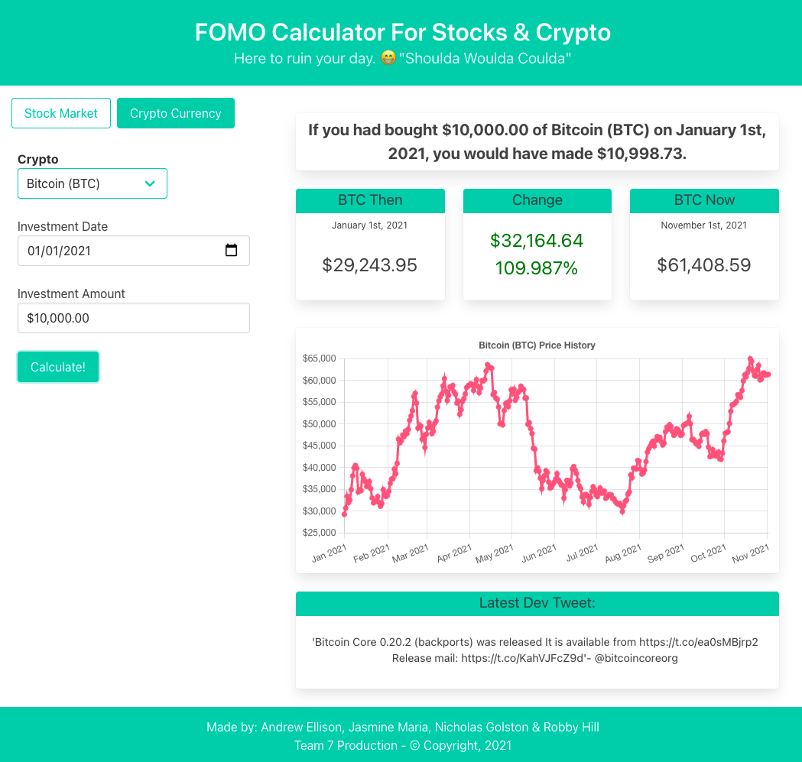

# FOMO-Calculator
This application uses historical bitcoin and stock exchange data to show a user just how much they could have made if they invested in any given stock or cryptocurrency.

See the app live at: [FOMO Calculator](https://jasminetuff.github.io/FOMO-Calculator/)

And learn about our process at: [FOMO Calculator Presentation](https://docs.google.com/presentation/d/1d5u3nkatsspUswffMug0da4wxB3pEPL0l9yBiaCZTXY/edit?usp=sharing)

## Key Features
- Swap between stocks and cryptocurrency
- Drop down menus to select from major stocks and crypto currencies
- User selects an investment start date from a Date Picker and enters an input value
- App calls coinpaprika (crypto) or yh-finance (stock) apis to gather historic and current price data
- Display historical stock ticker information from the investment start date
- Calculate potential earnings or losses based on the selected coin/stock, start date and investment value

## Project Team
* Robby Hill : (robbyhill20)[https://github.com/Robbyhill20]
* Nick Golston : (ngolston)[https://github.com/Ngolston]
* Jasmine Santa Maria : (JASMINETUFF)[https://github.com/JASMINETUFF]
* Andrew Ellison : (ellisonac)[https://github.com/Ellisonac] 

## Example Page Output

